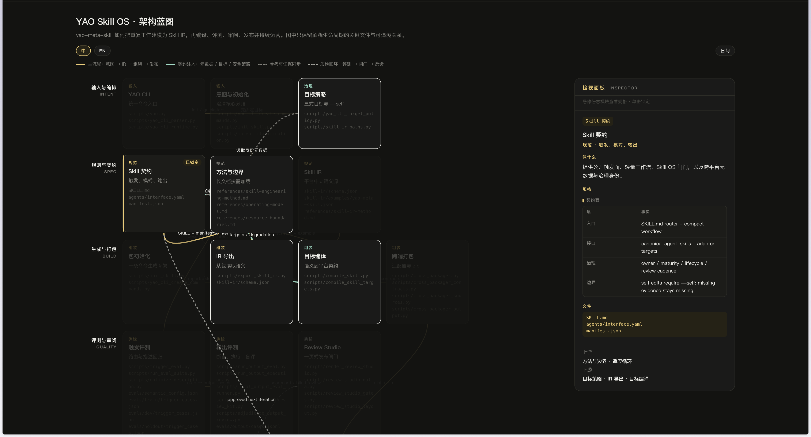

# GitHub Diagram Skill

一个面向 Codex 的仓库架构图技能包。它会读取 GitHub 仓库或本地代码仓库中的真实文件、入口、配置、导入关系和验证流程，生成无需构建、无需外部资源的交互式单文件 HTML 架构图。

它适合回答：

- 这个项目是怎么组织的？
- 哪些模块负责什么，它们之间如何连接？
- 能不能把这个 GitHub 仓库画成一张可交互的架构图？

它不是完整目录树生成器，也不是符号级调用图分析器。对于业务流程图、UI 原型或函数级调用关系，应使用更适合的工具。

## 特性

- 证据优先：模块和连线必须能从仓库文件、导入、配置、调用、生成或验证流程中追溯。
- 单文件交付：生成的 HTML 内联 CSS、JavaScript 和数据，不依赖构建步骤或外部 CDN。
- 交互式浏览：支持模块检视、关系高亮、hover、单击锁定、主题切换和中英文切换。
- 响应式布局：生成后检查桌面与窄屏布局，并在 Codex 右侧浏览器面板中预览。
- 可验证：内置 HTML 校验脚本，检查脚本语法、模块和连线引用、泳道、主题、语言、文件大小及外部资源。

## 安装

这是一个 Codex Skill，不是需要 `npm install` 的独立 Web 应用。

### 安装到 Codex Skills 目录

将仓库克隆到 Codex 的 skills 目录。把 `<CODEX_HOME>` 替换为本机的 Codex 配置目录：

```bash
git clone git@github.com:gym0915/github-diagram-skill.git \
  <CODEX_HOME>/skills/github-diagram-skill
```

如果已经有本地副本，可以直接更新：

```bash
git -C <CODEX_HOME>/skills/github-diagram-skill pull --ff-only
```

安装完成后，在 Codex 中提出仓库架构分析请求即可触发该技能。若当前会话没有立即识别到更新，重新打开会话即可。

### 本地开发环境

辅助脚本使用 Node.js ESM，建议使用 Node.js 18 或更高版本。项目没有额外的 npm 依赖：

```bash
node --version
```

## 使用

### 在 Codex 中调用

可以直接提供本地仓库路径或 GitHub URL：

```text
帮我分析 /path/to/my-repo，生成一张可交互的架构图，重点展示入口、核心模块、配置和测试之间的关系。
```

```text
Turn this GitHub repository into an interactive architecture map. Show the important modules and only evidence-backed relationships.
```

默认产物写入当前 Skill 项目的 `output/<descriptive-name>.html`。生成完成并通过校验后，技能会在 Codex 当前任务的右侧浏览器面板中打开本地 HTML，不会启动系统浏览器。

### 辅助扫描

对于较大的仓库，可以先生成文件清单和体量统计。这个脚本只扫描文件，不替代语义分析：

```bash
node scripts/extract-modules.mjs /path/to/my-repo
```

也可以将结果写入 JSON 文件：

```bash
node scripts/extract-modules.mjs /path/to/my-repo --out /tmp/repo-files.json
```

### 校验 HTML

生成 HTML 后运行：

```bash
node scripts/validate-html.mjs output/<descriptive-name>.html
```

校验通过后，应在 Codex 侧边栏浏览器中查看效果，并检查桌面、窄屏、浅色、深色、hover、单击锁定和语言切换状态。

## 生成效果

### 交互式架构图截图

> 📷 效果图占位符：请提供一张生成结果的浏览器截图后，保存为 `docs/images/architecture-preview.png`，并在此处替换占位内容。

<!-- TODO: 收到截图后，将下方占位说明替换为：

-->

### 已生成的 HTML 示例

仓库中已经包含以下可直接打开的示例产物：

- [Nuwa Skill 架构图](output/nuwa-skill-architecture.html)
- [Beautiful HTML Templates 架构图](beautiful-html-templates-architecture.html)
- [GC Minimal Zine Poster 架构图](gc-minimal-zine-poster-architecture.html)

这些文件都是独立 HTML，可以下载后直接用浏览器打开，也可以交给 Codex 在右侧浏览器面板中预览。

## 工作流

1. 确认目标仓库和输出位置。
2. 阅读 README、包清单、入口、配置、核心实现和测试。
3. 按实际职责提炼泳道和模块，忽略 vendored、generated、cache 和依赖目录。
4. 只保留有仓库证据支持的关系，不因目录相邻而臆造连线。
5. 根据数据契约填充模块、连线、泳道和国际化数据。
6. 生成并校验单文件 HTML。
7. 在 Codex 右侧浏览器面板中预览最终产物。

详细规则见 [`SKILL.md`](SKILL.md)，分析方法见 [`references/methodology.md`](references/methodology.md)。

## 项目结构

```text
.
├── SKILL.md                         # Codex 技能入口与执行契约
├── assets/engine.html               # 数据驱动的单文件 HTML 引擎
├── scripts/
│   ├── extract-modules.mjs          # 文件清单与体量扫描
│   └── validate-html.mjs            # HTML 结构与质量校验
├── references/
│   ├── data-schema.md               # MODULES、LINKS、LANES 等字段约束
│   ├── design-tokens.md             # 视觉 token 和主题规则
│   ├── methodology.md               # 证据优先的分析方法
│   └── repo-types.md                # 不同仓库类型的划分参考
├── evals/                           # 触发、排除和邻近任务样例
└── output/                          # 生成的架构图 HTML
```

## 边界与注意事项

- 这是架构理解图，不承诺覆盖完整的运行时调用链。
- 用户要求函数级或符号级调用图时，应改用静态分析工具，并明确覆盖范围。
- 不确定的关系应省略或标注为推断。
- 产物不能包含生成机器的绝对路径、凭据或私有环境信息。
- 生成前检查同名文件，避免覆盖已有 HTML。

## License

[MIT](LICENSE)
